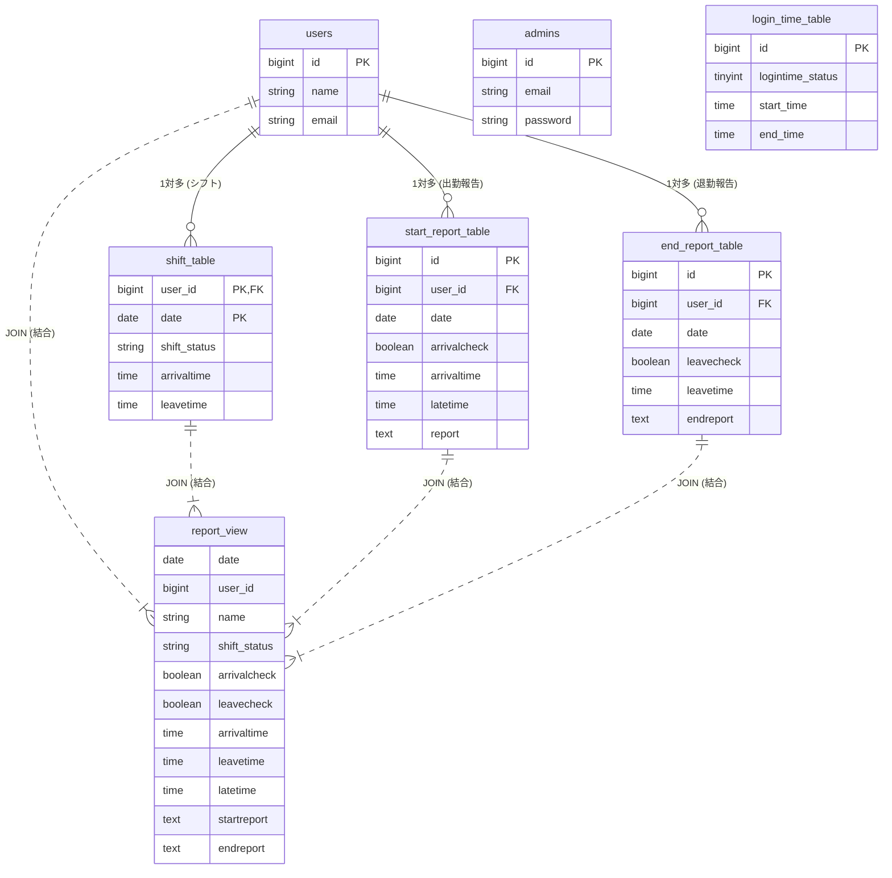

# 業務報告管理システム

## 概要
本アプリケーションは、就労支援施設向けの「業務報告・勤務状況管理システム」です。施設利用者が日々行う出退勤時の業務報告を一元管理し、スタッフの管理業務を効率化するために開発しました。

---

## 開発の背景
元々は、バーチャルオフィス（MetaLife）のチャット上の業務報告を、スタッフが毎日手書きでExcelに転記しており、大きな作業負荷となっていました。当時、事業所内で唯一プログラミングができた私に「システムを作ってほしい」と依頼があり、生PHPでの開発をスタートしました。

しかし、社内にセキュリティ面に詳しい有識者がおらず、また予算の確保も難しかったことから、安全な運用を担保することが困難と判断され、事業所としての開発は途中で中止となりました。

ですが、このWebアプリケーションでの課題解決が楽しかったのでより高度なものを作りたいと思い、ソースコードをポートフォリオとして譲り受けました。社内で懸念されていたセキュリティや保守性の課題をクリアするため、Webフレームワーク（Laravel）を導入し、システムをモダンに再構築して完成させました。

---

## 想定されるユースケース
本システムは、主に以下の2つの目的でスタッフに利用されることを想定しています。

1. **施設利用者の適切な評価・面談への活用**
   日々の具体的な業務内容や報告内容をシステム上でいつでも振り返ることができるため、利用者の能力評価や定期面談のフィードバックに活用します。
2. **勤怠データの裏付け**
   別の勤怠アプリケーションで利用者が「出勤・退勤ボタン」を押し忘れてしまった際、本システムに「その日の業務報告」が正しく残っているかを確認することで、実際に勤務していたかどうかの確実な裏付け（エビデンス）として利用します。

- **URL:** [https://attendance-manager-ud3c.onrender.com/admin/login](https://attendance-manager-ud3c.onrender.com/admin/login)
- **テストユーザー:** ID: admin@mail.com / Pass: admin-01

---

## 動作環境・前提条件

開発および動作に必要な環境は以下の通りです。

* **PHP**: `8.2.x` 以上
* **データベース**: MariaDB `10.4.32`
* **Webサーバー**: Apache (XAMPP)
* **フレームワーク**: Laravel `11.x`
* **フロントエンド**: Bootstrap `5.3` (CDN経由で読み込み)

---

## 機能一覧

### 全画面機能
* マルチログイン機能
* パスワード変更機能

### 管理者画面機能
* **業務報告管理**
    * 業務報告一覧の閲覧・詳細検索（日付、月、利用者ID、シフト、報告内容のAND/OR検索、遅刻あり絞り込み）
    * 報告データの削除
    * 業務報告書のダウンロード（CSV）
* **利用者アカウント管理**
    * 利用者一覧のCRUD
    * 利用者ログイン可能時間の設定
* **シフト管理**
    * シフトの個別編集
    * シフトの一括削除
    * CSVによるシフトインポート
* **管理者アカウント管理**
    * 管理者一覧のCRUD
    * 自身のパスワード変更

### 利用者画面機能
* 出勤・退勤の打刻兼業務報告

---

## ログ出力仕様（統一フォーマット）

ログの第1引数は `[対象] [アクション]` の固定英語とし、第2引数にコンテキスト情報を配列で持たせます。

| 機能 | メッセージ | ログレベル | 記録される主な内容 |
| :--- | :--- | :--- | :--- |
| **管理者ログイン成功** | `'Admin logged in'` | `INFO` | 操作者ID, IPアドレス, UserAgent |
| **管理者ログイン失敗** | `'Admin login failed'` | `WARNING` | email, IPアドレス, UserAgent |
| **管理者ログアウト** | `'Admin logged out'` | `INFO` | 操作者ID, IPアドレス |
| **利用者ログイン成功** | `''` | `INFO` | |
| **利用者ログイン失敗** | `''` | `WARNING` |  |
| **利用者ログアウト** | `''` | `INFO` |  |
| **管理者登録** | `'Admin created'` | `INFO` | 操作者ID, 対象ID, 登録内容 |
| **管理者更新** | `'Admin updated'` | `INFO` | 操作者ID, 対象ID, 変更前 ➔ 変更後 |
| **管理者削除** | `'Admin deleted'` | `INFO` | 操作者ID, 対象ID, 対象者名 |
| **利用者登録** | `'User created'` | `INFO` | 操作者ID, 対象ID, 登録内容 |
| **利用者更新** | `'User updated'` | `INFO` | 操作者ID, 対象ID, 変更前 ➔ 変更後 |
| **利用者削除** | `'User deleted'` | `INFO` | 操作者ID, 対象ID, 対象者名 |
| **ログイン時間制限** | `'Logintime_set updated'` | `INFO` | 操作者ID, 対象ID, 変更前 ➔ 変更後  |
| **シフトインポート** | `'Some users shift imported'` | `INFO` | 操作者ID, 対象ID, 対象月 |
| **シフト更新** | `'User shift updated'` | `INFO` | 操作者ID, 対象ID, 対象月 |
| **全体シフト更新** | `'All users shift updated'` | `INFO` | 操作者ID, 対象ID, 対象月, 対象人数 |
| **シフト削除** | `'Shift deleted'` | `INFO` | 操作者ID, 対象月 |
| **CSV出力** | `'Work report CSV downloaded started'` | `INFO` | 操作者ID, 出力件数, 検索パラメーター |
| **管理者パスワード更新** | `'Admin password updated'` | `INFO` | 操作者ID, 対象ID |
| **利用者パスワード更新** | `'User password updated'` | `INFO` | 操作者ID, 対象ID |

---

## ローカル開発環境セットアップ

### 1. リポジトリのクローンと移動
```bash
git clone <repository-url>
cd <project-folder>
```

### 2. 依存パッケージのインストール
```bash
composer install
npm install && npm run dev
```

### 3. 環境設定ファイルの準備
```bash
cp .env.example .env
php artisan key:generate
```

### 4. データベースのマイグレーション
```bash
php artisan migrate --seed
```

### 5. サーバー起動
```bash
php artisan serve
```

---

## 🔍 ログの検索方法（開発用）

ターミナルから `grep` を使って特定の操作ログをピンポイントで抽出可能です。

**例：操作者IDが「5」のログだけを抽出する**
```bash
grep '"operator_id":5' storage/logs/laravel.log
```

**例：CSVダウンロードのログだけを抽出する**
```bash
grep 'Work report CSV downloaded' storage/logs/laravel.log
```

---

## こだわったポイント・苦労した点

### 1. 実務に即したカレンダー表示と外部ライブラリの活用
* **こだわり：** 利用者の使いやすさを最優先に考え、実務的なカレンダー表記を採用しました。
* **工夫した点：** 日本の複雑な祝日判定に対応するため、**`Yasumi` ライブラリ**を自力で導入。土日祝日を正確に自動色分けし、一目でシフト状況が把握できる視覚的な分かりやすさを実現しました。

### 2. 最新バージョンへの追従と環境構築エラーの突破
* **苦労した点：** 2024年の開発着手から約1年のブランクを経て開発を再開した際、**Laravel 11へのメジャーアップデートによる構造の大幅な変更**（`Kernel.php` の廃止、および `bootstrap/app.php` への集約）に直面しました。さらに、自宅のローカル環境（XAMPPのPHPバージョン）との不整合により、`artisan` コマンドが一切動かないトラブルも同時に発生しました。
* **乗り越え方：** ネット上にある古い解説記事の通りにファイルが存在しない状況の中、公式ドキュメントをベースに「現代のLaravelの記述方法」へと自力で翻訳・キャッチアップ。環境変数や依存関係のエラーを一つずつ問題を切り分けて解消し、最新環境での安定動作へと繋げました。

### 3. レガシーコードからの脱却とセキュリティ対策の徹底
* **苦労した点：** 過去にプレーンなPHPで書いていた頃は、セキュリティ面への配慮が不足していました。そのため、二重送信を防ぐ**PRGパターンの適用**や、不正な入力を弾く**バリデーションの実装**を、すべてのフォームに対して地道に1つずつリファクタリングしていく作業に非常に苦労しました。
* **成果：** 泥臭い作業でしたが、かつてエンジニアとして培った粘り強さを発揮し、すべてのチェックを完了させました。

### まとめ
この一連の経験を通じて、単にコードを書くだけでなく、**環境構築・依存関係管理・DB設計・ルーティング・認証**といったLaravelの基礎を深く体系的に理解することができました。また、未知のエラーに直面した際、問題を切り分けて自力で解決する「自走力」が大きく向上したと実感しています。

---

## データベース構造



---

## 今後の修正・追加機能
* 報告画面のLog機能追加
* コード整理
* 業務報告を1つのテーブルにまとめる。
* 全テーブルに作成更新日時を追加する。
* 利用者画面のマイページ、シフト、報告内容修正機能追加する。
* シフト画面の１月ごとに移動ボタン追加する。
* 利用者・管理者の検索機能追加する。
* ログイン前のパスワード変更機能追加する。
